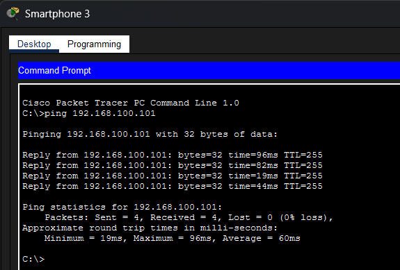
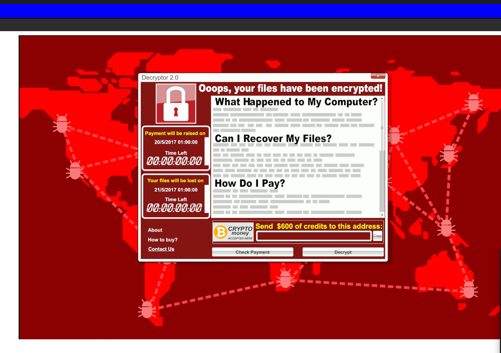
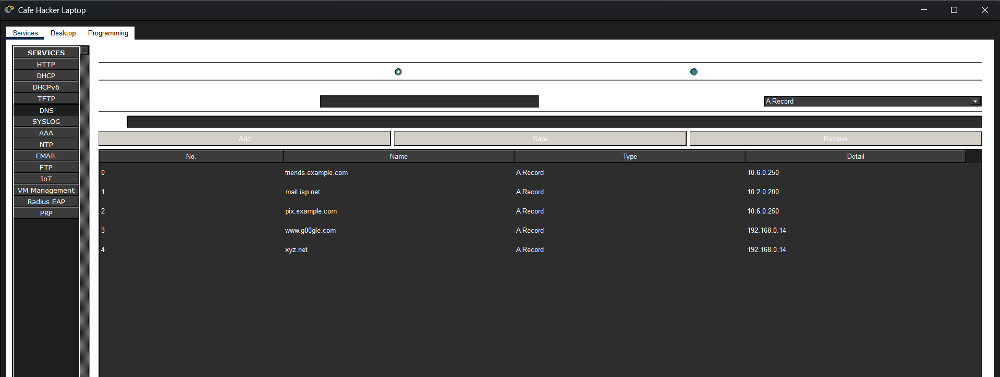
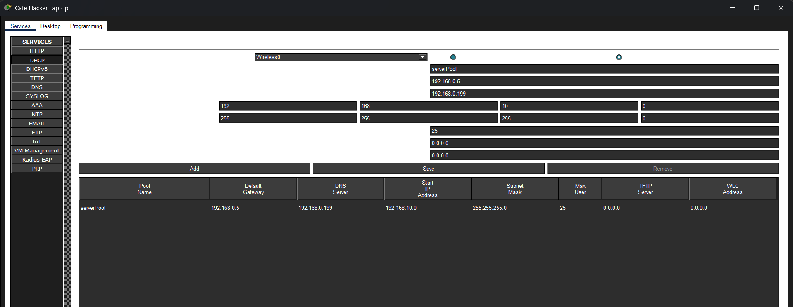

# Lab: Investigating the Threat Landscape

##  Project Overview
This lab involved a multi-stage investigation into how vulnerabilitiesb oth technical and human are exploited by threat actors. I analyzed three distinct scenarios to identify, exploit, and propose remediations for common security gaps in a simulated enterprise and home environment.

---

##  Phase 1: Network Configuration Vulnerability
In this phase, I analyzed how a simple misconfiguration in a home wireless router can lead to a full network compromise.

* **Discovery:** Identified an open Guest Wi-Fi network that lacked logical isolation.
* **Lateral Movement:** Using a smartphone on the Guest segment, I performed a network sweep and successfully pinged an internal IoT Webcam (`192.168.100.101`).
* **Critical Finding:** The Home Router was left with default credentials, allowing unauthorized management access.

**Technical Evidence:**

---

##  Phase 2: Phishing & Ransomware Delivery
This scenario simulated the "Human Element" of the threat landscape, demonstrating how a single click can bypass network defenses.

* **The Hook:** Analyzed a simulated phishing email containing a malicious URL.
* **The Payload:** Upon navigating to the link, the system was "infected" with a simulated **WannaCry (Decryptor 2.0)** ransomware package.
* **Impact Analysis:** All user files were encrypted, and a $600 Bitcoin ransom was demanded. This highlights the urgent need for robust endpoint protection and user awareness training.

**Technical Evidence:**

---

##  Phase 3: The "Evil Twin" & DNS Hijacking
In the final phase, I investigated a sophisticated **Man-in-the-Middle (MitM)** attack at a public cafe.

* **Scenario:** A threat actor used a rogue Access Point (Hacker Backpack) to intercept traffic from cafe customers.
* **The Attack:** 1. The hacker's laptop acted as a **Rogue DHCP Server**, pushing its own IP as the victim's DNS server.
    2. When the victim attempted to visit a legitimate site (`friends.example.com`), the hacker's **Rogue DNS Service** redirected them to a malware server.
* **Technical Proof:**
    * **Victim DNS:** `192.168.0.199` (Hacker's IP)
    * **Poisoned Record:** `friends.example.com` -> `10.6.0.250` (Malware Host)

**Technical Evidence:**

---

## Remediation & Professional Insights
As an aspiring Cybersecurity Analyst, I recommend the following "Defense in Depth" strategy based on these findings:

1. **Network Level:** Enable **AP Isolation** on all guest networks to prevent lateral movement.
2. **System Level:** Implement **DNSSEC** to ensure DNS responses are authenticated and have not been tampered with.
3. **Human Level:** Implement **Security Awareness Training** to help users identify phishing indicators (suspicious URLs, sense of urgency).
4. **Encryption:** Use a **VPN** on all public/untrusted Wi-Fi networks to tunnel traffic securely away from local MitM threats.

---

**Maintained by Princess** *MSc Cybersecurity Candidate | CCST Cybersecurity Certified*
